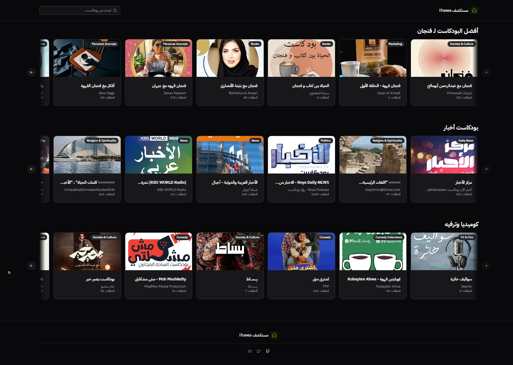

# iTunes Explorer

A Next.js application for exploring iTunes content, built with modern web technologies.



## Tech Stack

- **Framework**: [Next.js](https://nextjs.org) 16.0.1
- **React**: 19.2.0
- **TypeScript**: ^5
- **Database**: Drizzle ORM 0.44.7 with PostgreSQL
- **API Layer**: tRPC 11.7.1
- **Styling**: Tailwind CSS 4
- **UI Components**: Radix UI, shadcn/ui
- **State Management**: TanStack Query 5.90.5
- **Forms**: React Hook Form 7.65.0 with Zod 4.1.12
- **Linting/Formatting**: Biome 2.2.0

## Getting Started

### Prerequisites

- Node.js 22+
- pnpm (recommended) or npm/yarn/bun

### Installation

```bash
pnpm install
```

### Development

Run the development server:

```bash
pnpm dev
```

Open [http://localhost:3000](http://localhost:3000) with your browser to see the result.

### Database Commands

```bash
# Push database schema changes
pnpm db:push

# Generate database migrations
pnpm db:generate

# Run migrations
pnpm db:migrate

# Open Drizzle Studio (database GUI)
pnpm db:studio

# Drop database (use with caution)
pnpm db:drop
```

### Scripts

- `pnpm dev` - Start development server
- `pnpm build` - Build for production
- `pnpm start` - Start production server
- `pnpm lint` - Run Biome linter
- `pnpm format` - Format code with Biome

## Project Structure

- `/src/app` - Next.js App Router pages and components
- `/src/components` - Reusable UI components
- `/src/server` - tRPC server and router definitions
- `/src/db` - Database schema and migrations
- `/src/trpc` - tRPC client configuration
- `/src/types` - TypeScript type definitions

## Learn More

- [Next.js Documentation](https://nextjs.org/docs)
- [tRPC Documentation](https://trpc.io)
- [Drizzle ORM Documentation](https://orm.drizzle.team)
- [TanStack Query Documentation](https://tanstack.com/query)

## Deploy on Vercel

The easiest way to deploy your Next.js app is to use the [Vercel Platform](https://vercel.com/new?utm_medium=default-template&filter=next.js&utm_source=create-next-app&utm_campaign=create-next-app-readme) from the creators of Next.js.
